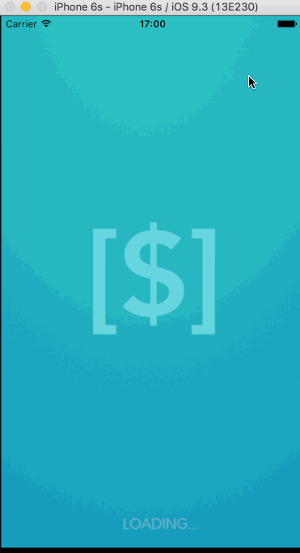

# Pre-work - *smarTips*

**SmarTip** is a tip calculator application for iOS.

Submitted by: **Jean Menezes**

Time spent: **30** hours spent in total

## User Stories

The following **required** functionality is complete:

* [x] User can enter a bill amount, choose a tip percentage, and see the tip and total values.

The following **optional** features are implemented:
* [x] Custom font
* [x] UI animations
* [x] Making sure the keyboard is always visible and the bill amount is always the first responder. This way the user doesn't have to tap anywhere to use this app. Just launch the app and start typing.

The following **additional** features are implemented:
- [x] Settings page to change the default tip percentage.
- [x] Remembering the bill amount across app restarts (if <10mins)
- [x] Remembering user default percentage across app restarts (if <10mins)
- [x] Using locale-specific currency and currency thousands separators.
- [x] Background image
- [x] app Icon
- [x] added split bill functionality for up to 7 people
- [x] updated UI to Iphone 6s

## Video Walkthrough 

Here's a walkthrough of implemented user stories:

 
                
GIF created with [LiceCap](http://www.cockos.com/licecap/).

## Notes

I'm recently took the IOS Codepath for universities. It was an amazing experience and I can tell i eveolved a lot, just by revamping my tip calculator project. I was able to debug and implement lots of functionalities which would be impossible a couple of months ago.
Anyway, I'm really excited about the curriculum in this program, because of its focus on design prototyping. I've dedicated a lot of time and energy to the IOS University program, but cant' help to feel that previous knowledge stops me from being in the top of the class.. I feel that in this program focused on the design aspects of it i can get a lot more out. Thanks in advance.

## License

    Copyright [2015] [Jean Menezes]

    Licensed under the Apache License, Version 2.0 (the "License");
    you may not use this file except in compliance with the License.
    You may obtain a copy of the License at

        http://www.apache.org/licenses/LICENSE-2.0

    Unless required by applicable law or agreed to in writing, software
    distributed under the License is distributed on an "AS IS" BASIS,
    WITHOUT WARRANTIES OR CONDITIONS OF ANY KIND, either express or implied.
    See the License for the specific language governing permissions and
    limitations under the License.
